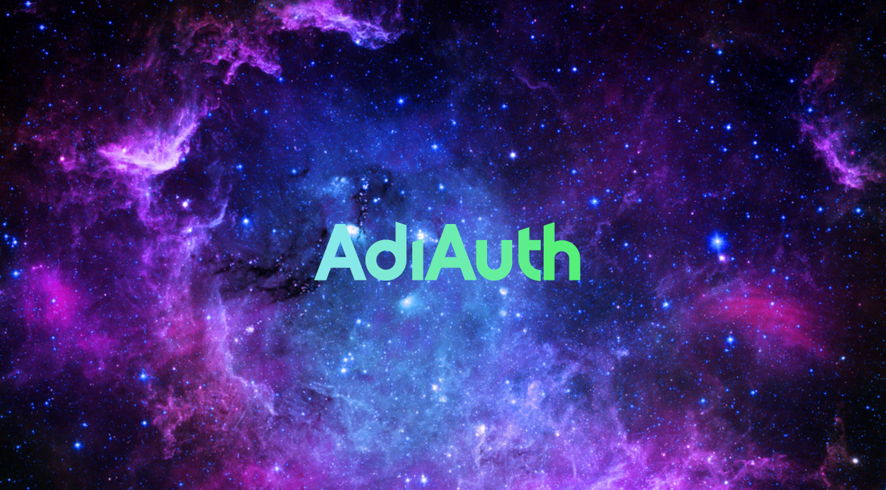

# AdiAuth

 
 
<h2>A <b>free</b> hybrid auth plugin for bungeecord</h2>
  
It automatically logs in premium players, only cracked players need to login manually
  
It is very simple to use, Just put the plugin in your bungeecord server, configure the mysql database and then put it in hub servers and auth servers as well
  
It also has a lot of configurable options in the config.yml in bungeecord
There is no config for the backend servers, everything can be configured directly in the bungeecord server reducing a lot of hassle for all server owners :smile:
 
<h2>Features</h2>
- Discord 2fa  
- HubServer and authserver balancing  
- Logs in premium players without showing anything about authentication  
- Backup Server system  
- Can AutoUpgrade cracked players to premium.  
- Configurable Messages  
- Strong Discord 2fa Integration  

<h4>Important Points</h4>
- This plugin does not allow cracked players with premium names to join
 
- Premium players will always be logged in automatically

<h3>More features will be added soon!</h3>
<h3> Note: Multi Proxy environments are not supported yet!, please create an issue or comment on an existing issue if you are interested in this</h3>

### [Spigot Page](https://www.spigotmc.org/resources/adiauth.95828/)
### [Discord](https://discord.gg/bYWxMysquM)
